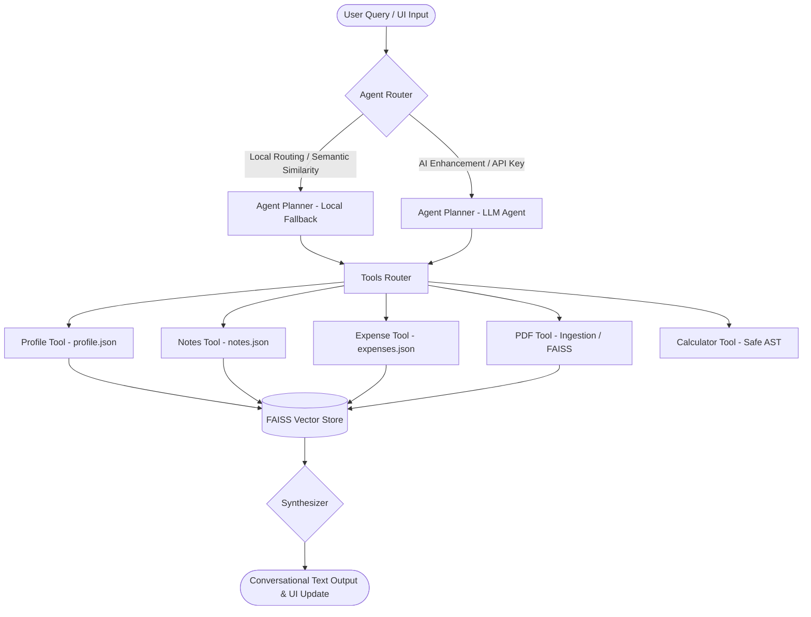

# 🧠 Personal Memory Agent

A state-of-the-art personal memory assistant designed to capture, synthesize, search, and calculate information from notes, expenses, PDF documents, and profile facts. The agent operates in a hybrid execution mode: **completely offline (local semantic search)** or **AI-enhanced (Gemini-powered query reasoning and synthesis)**.

This project is built using Python, Streamlit, FAISS Vector Store, Sentence Transformers, and the Google Gemini API.

---

## 🚀 Key Features

* **Multi-hop Semantic Search**: Intelligently routes queries to search notes, PDF text chunks, expense tables, and personal facts.
* **Unified Expense Tracker**: Log expenses, filter by categories, and visualize spending breakdowns with KPI metrics.
* **Semantic Document Ingestion**: Parse and chunk PDF documents (e.g., invoices, tickets, medical prescriptions, statements) and index them in a local vector database.
* **Intelligent Query Router**: Uses a local semantic/rule-based router or a Gemini-powered router to map user requests to appropriate database components.
* **Context-Aware Hybrid Memory**: Retains the last five interactions in session memory to support multi-turn conversational follow-ups.
* **Safe Local Mathematical Evaluator**: Evaluate arithmetic expressions locally using a secure AST (Abstract Syntax Tree) parser.

---

## 🛠️ Architecture Overview

The system architecture is designed to be modular and fully asynchronous (`asyncio` based):



---

## 💻 Tech Stack & Resume Highlights

* **Frontend / UI**: Streamlit (Premium layout with CSS customizations, Google Fonts, and custom glassmorphism components).
* **Database & Vector Search**: FAISS (Facebook AI Similarity Search) using `IndexFlatIP` (Cosine Similarity) over normalized embeddings.
* **Embeddings**: `SentenceTransformer` (`all-MiniLM-L6-v2`) for local offline vector searches.
* **LLM Engine**: Google Generative AI (`gemini-1.5-flash`) for intent classification, tool routing, and natural language synthesis.
* **Parsing & Extraction**: `ast` for mathematical expression parsing; `pypdf` for text extraction.
* **Asynchronous Design**: Full async execution loop utilizing Python `asyncio` to prevent thread blocking during database queries or network requests.

---

## ⚙️ Local Setup Instructions

### 1. Prerequisites
- Python 3.8 to 3.13 installed.

### 2. Clone and Install Dependencies
```bash
# Clone the repository
git clone https://github.com/yourusername/personal-memory-agent.git
cd personal-memory-agent

# Create a virtual environment
python -m venv venv
source venv/bin/activate  # On Windows use: venv\Scripts\activate

# Install optimized dependencies
pip install -r requirements.txt
```

### 3. Seed Database
Seed initial mock data (flight records, resort costs, profile facts, loan schedules, medical logs) to FAISS:
```bash
python seed_cli.py
```

### 4. Run the App
Launch the Streamlit interface:
```bash
streamlit run app.py
```

---

## 🌐 Render Deployment Guide

Follow these steps to deploy this application to **Render's Free Tier** successfully:

### 1. Configure the Web Service
Create a new **Web Service** on Render and link it to your GitHub repository.

### 2. Build and Start Settings
- **Runtime**: `Python`
- **Build Command**:
  ```bash
  pip install -r requirements.txt
  ```
- **Start Command**:
  ```bash
  streamlit run app.py --server.port $PORT --server.address 0.0.0.0
  ```

### 3. Environment Variables
No environment variables are strictly required to start the app because it falls back to local processing. However, users can input their Gemini API Key in the UI sidebar, or you can pre-configure it:
- `GEMINI_API_KEY`: *(Optional)* Your Google Gemini API Key.
